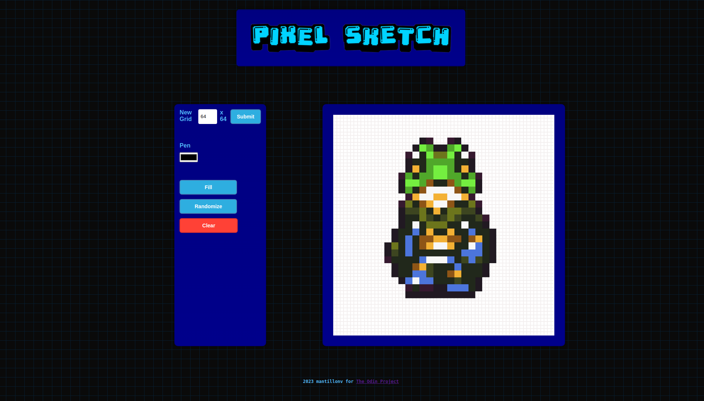

# Etch-a-Sketch
JS Foundations TOP Etch-a-Sketch Project 🥷

Create your own pixel art with **Pixel Sketch**.

- Create a canvas size up to 99 x 99 cells. 
- Select any color for the Pen and Fill tools.
- Randomize the RGB value for the Pen and Fill tools.
- Clear the grid instantly whenever you need to start over again.

<h2>Screenshot:</h2>
